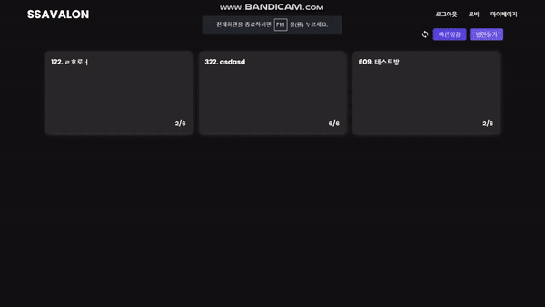
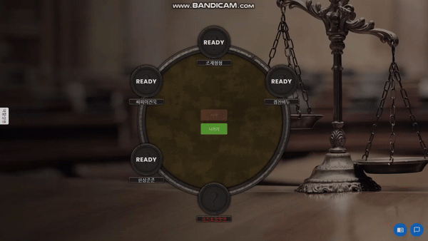
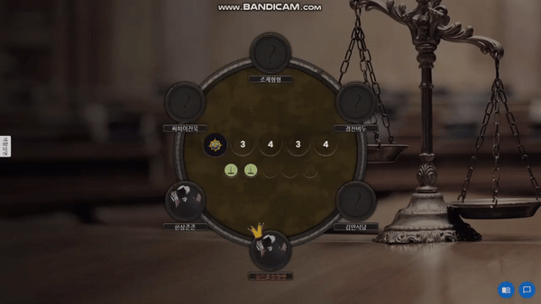
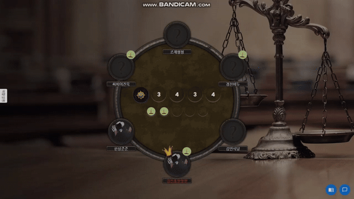
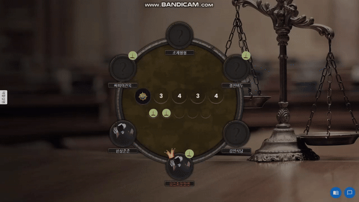
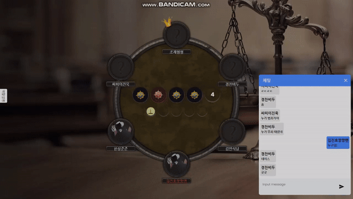
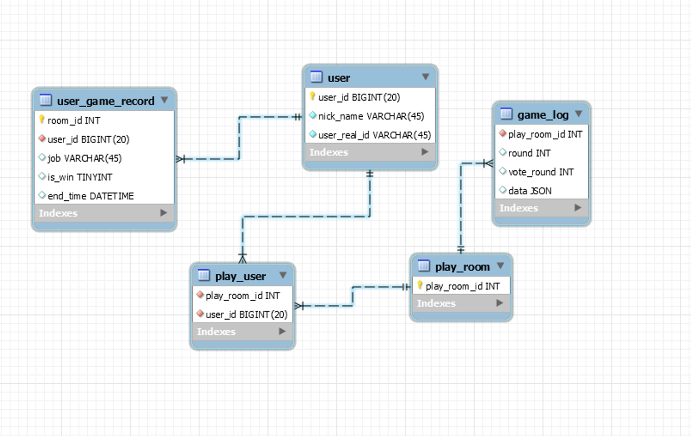
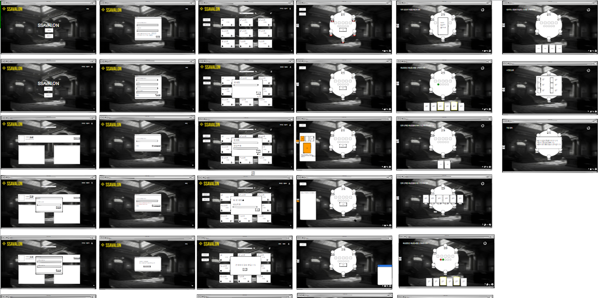

# 1. SSAVALON 소개

### ** 보드게임 '레지스탕스 아발론'을 현대적으로 재해석한 게임 **

🌵 보드게임 아발론을 직접 해보면서 느낀 불편한 점을 작성해보면서 보드게임을 웹서비스로 이식해서
물리적인 불편함을 해소해보자 만든 프로젝트 입니다.

| 중세보단 친숙한 현대의 재판진행에서 게임진행의 모티브를 얻었고 사회자의 역할이 없어서 기존보다 적은 인원으로 플레이가 가능합니다.

# 2. 🔍 개발 환경

## 2-1. 환경 설정

### **👨‍💻 Front-end**

    - Visual Studio Code

    - react.js 18.2.0

    - react-redux 8.0.5

    - Node.js 18.16.0

### **👨‍💻 Back-end**

    - Intellij 2022.3.1

    - SpringBoot 2.7.8

    - gradle 7.4.2

    - JDK 11.0.17

### **👨‍💻 DB**

    - MySQL 8.0.30

    - Redis 7.0.8

### **👩‍💻 CI/CD**

    - Server : AWS EC2 Ubuntu 20.04 LTS

# 3. 🦈 주요 기능

## 3-1. 서비스 소개

#### 1. 랜딩 페이지

    -  랜딩 페이지를 통해 게임에 대한 전반적인 정보를 파악할 수 있습니다.

#### 2. 게임참가

    - 로비에서 게임을 생성하거나 참여할 수 있습니다.

#### 3. 게임시작

    - 방장을 제외한 모든 인원이 준비를 완료하면 게임을 시작할 수 있습니다.

#### 4. 채팅

    - 채팅을 통해 게임 중 다른 플레이어와 소통할 수 있습니다.

#### 5. 배심원단 선정

    - 배심원장이 되면 배심원단 인원을 선택할 수 있습니다. 선택을 완료하면 모든 플레이어가 배심원단의 인원 구성에 대한 찬성/반대 투표를 진행합니다.

#### 6. 배심원단 선정 결과

    - 투표를 완료하면 모든 플레이어의 배심원단 인원 구성에 대한 찬성/반대 여부를 확인할 수 있습니다.

#### 7. 유무죄 투표

    - 과반수 이상의 찬성으로 배심원단 선정이 완료될 경우 배심원단이 유무죄 투표를 할 수 있습니다.

#### 8. 범죄자 경찰지목

    - 유죄가 3표 이상 나온다면 범죄자는 경찰을 선택하는 최후의 선택을 하고 틀릴경우 시민의 승리가 됩니다.

# 4. 📁 설계 문서

## 4-1. ERD

## 4-2. Figma

# 5. 🖊 Cooperation&Promises

## 5-1. Tools

    - Git
    - Jira
    - Notion
    - Mattermost
    - Webex

## 5-2. Convention

#### - FE CONVENTION

    - html,css 작성시 snake case를 사용한다
    - 컴포넌트의 이름은 Pascal case 로 작성한다.
    - 컴포넌트가 아닌것들의 이름은 Camel case 로 작성한다.
    - Unit test파일명은 대상 파일명과 동일하게 작성한다.
    - 속성명은 Camel case 로 작성한다.
    - null 또는 undefined일 수 있는 값은 optional chainging 연산자를 사용한다
    - 외부 데이터는 props로 받아서 사용한다.
    - props는 절대 직접 수정하지 않는다.
    - spared 연산자를 사용한다.
    - var는 사용하지 않는다.
    - 되도록 arrow function을 사용한다.
